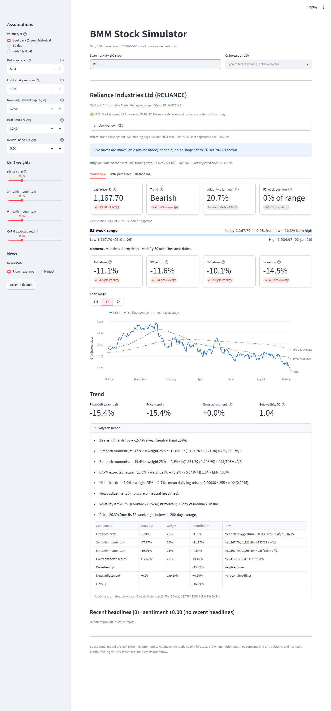
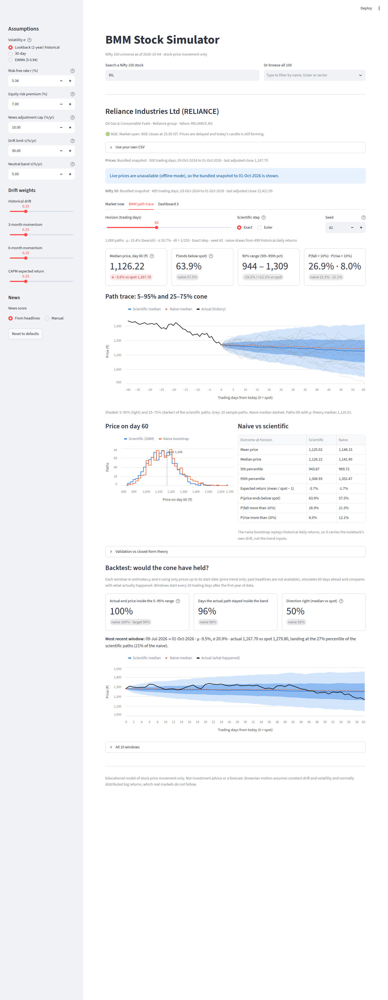

# BMM Stock Simulator

Search any Nifty 100 stock, see where it stands today, and simulate its price path with a
Brownian motion model (naive bootstrap vs scientific GBM), with a class-layout Excel export.

> Educational model of stock price movement only. Not investment advice or a forecast.

## Run locally

```bash
python3.12 -m venv .venv && source .venv/bin/activate
pip install -r requirements-dev.txt
streamlit run app.py
pytest -q
```

## Roadmap

| Phase | Deliverable | Status |
|---|---|---|
| 1 | Search + Nifty 100 universe | Done |
| 2 | Data layer (Yahoo prices + headlines, cache, CSV fallback) | Done |
| 3 | Trend engine (μ, σ) | Done |
| 4 | Dashboard 1: Market now | Done |
| 5 | Dashboard 2: BMM path trace | Done |
| 6 | Excel export | Done |
| 7 | Dashboard 3 placeholder | |
| 8 | Package + deploy | |

## Stock search

| You type | Result |
|---|---|
| `Reliance`, `RELIANCE`, `RIL`, `RELIANCE.NS` | Loads Reliance Industries |
| `Tata` | Pick list of all 9 Tata group stocks, including Titan and Trent |
| `Tata Motors` | Pick list: TMPV (passenger) or TMCV (commercial), after the 2025 demerger |
| `M&M`, `Mahindra`, `HUL`, `SBI`, `Zomato` | Loads by ticker, nickname or name |
| `Relaince`, `Infosis` | "Did you mean" pick list |
| `AAPL`, `TSLA`, `Paytm` | "Not in the Nifty 100 universe for now" + closest Nifty 100 matches (sector peers for well-known global names) |

The universe lives in [`data/nifty100.csv`](data/nifty100.csv): NSE symbol, Yahoo symbol, name,
sector, business group, aliases, ISIN and the `as_of` date it was taken from NSE. The
[Universe check](.github/workflows/universe-check.yml) workflow diffs it against NSE's official
list and checks every Yahoo symbol weekly, opening an issue when something changes (NSE
rebalances the index each March and September).

## Data

| Need | Source, in order | Notes |
|---|---|---|
| Daily prices (2 years) | Your CSV upload → Yahoo Finance → bundled snapshot | Adjusted close for all returns. Yahoo results cached 15 minutes; failures retried after 2 minutes |
| Nifty 50 (for beta) | Your CSV upload → Yahoo `^NSEI` → bundled snapshot | If none is available, beta falls back to 1.0 |
| Headlines (14 days) | Yahoo Finance + Google News RSS, merged and de-duplicated | Best effort: a failed source becomes a note, never an error |
| Market status | NSE hours 09:15–15:30 IST, holidays from `exchange_calendars` (XBOM) | Shows "unknown" past the calendar's last date (currently 31-Dec-2026) |

**Bundled snapshot.** Only Reliance and the Nifty 50 are bundled (`data/snapshots/`), to stay
within Yahoo's terms for a public repo. The [Snapshot](.github/workflows/snapshot.yml) workflow
refreshes them. Any other stock needs a live download or an upload.

**CSV upload.** A `Date` column and an `Adj Close` column (`Close` is accepted, with a warning).
Dates may be `YYYY-MM-DD` or day-first (`18/08/2026`, `18-Aug-2026`); thousands separators are
fine. At least 60 trading days, ideally 2 years.

**Tests.** `pytest` runs offline (`BMM_OFFLINE=1` is set automatically). The live path is tested
by the [Live data](.github/workflows/live-data.yml) workflow (`BMM_LIVE=1 pytest tests/test_live.py`)
on weekdays after the close and whenever the data code changes.

## Trend engine

Mirrors the class-layout workbook's Inputs sheet formula for formula; `tests/test_trend.py`
reproduces every value of the verified sample (`reference/BMM_RELIANCE_60d_sample.xlsx`: final
μ −7.1%, σ 21.1%, β 1.06) to 1e-12.

| Quantity | Formula (255 trading days a year) |
|---|---|
| σ lookback (default) | STDEV(daily log returns) × √255 |
| σ 30-day / EWMA | Last 30 returns / RiskMetrics λ 0.94, both × √255 |
| Historical drift | mean daily log return × 255 + σ²/2 |
| 3- / 6-month momentum | ln(S₀ / S₋₆₃) × 255/63 + σ²/2, ln(S₀ / S₋₁₂₆) × 255/126 + σ²/2 |
| CAPM | r + β × ERP; r = 5.34% (91-day T-bill), ERP 7%; β = SLOPE of stock vs Nifty 50 log returns |
| Price-trend μ | Weighted average (0.25 each, editable) |
| News adjustment | sentiment score (−1…+1) × 10% cap |
| Final μ | price-trend μ + news, clamped to ±30%; label Bearish / Neutral / Bullish at ±5% |

**Sentiment.** VADER, with the Loughran-McDonald finance word list (data/lm_lexicon.csv, from the
Notre Dame SRAF Master Dictionary via pysentiment2) added where VADER has no entry, and a small
market-move list (data/market_lexicon.csv: falls, slumps, surges, upgrade, 52-week low/high…)
that overrides both. Plain VADER scores "stock falls 3%, Nifty slumps to six-month low" as
positive; this scores it −0.65. The stock's score is the average headline score, scaled down
when there are fewer than 5 headlines. Every assumption, including a manual news score, is
editable in the sidebar.

## Dashboard 1: Market now



| Section | What it shows |
|---|---|
| Headline tiles | Last price and day change (labelled "today, session in progress" or "last session"), trend label and μ, volatility σ with 30-day regime, position in the 52-week range |
| 52-week range | Low, high and dates, with today's price marked on a meter |
| Momentum | 1M / 3M / 6M / 1Y price return, each compared with the Nifty 50 over the same dates |
| Price chart | Adjusted close with 50- and 200-day averages, 6M / 1Y / 2Y, hover tooltip |
| Trend | Final μ, price-trend μ, news adjustment, beta and the "Why this trend?" breakdown |
| Headlines | Last 14 days with each headline's sentiment score |

Works in light and dark mode and at phone width (`docs/screenshots/9`–`12`).

## Dashboard 2: BMM path trace



1,000 paths, dt = 1/255, horizon 20–120 trading days (default 60), seed 42 by default.

| Method | Step |
|---|---|
| Scientific, Exact (default) | S(t+1) = S(t) · exp((μ − σ²/2)·dt + σ·√dt·ε) |
| Scientific, Euler (class workbook) | S(t+1) = S(t) · (1 + μ·dt + σ·√dt·ε) |
| Naive bootstrap (class Sheet 1) | S(t+1) = S(t) · exp(a randomly drawn historical daily log return) |

Random draws follow `reference/bmm_export.py` exactly (`default_rng(seed)`: shocks first, then
bootstrap rows), so the app and the Excel export produce the same paths. On the class data
`tests/test_simulate.py` reproduces the verified sample path for path (all 60,000 scientific
and 60,000 naive values, the Bands and Summary sheets) to ~1e-12: median day-60 ₹1,300,
P(below spot) 57%.

The tab shows the outcome tiles (median, P(below spot), 90% range, P(±10%)), the 5–95% and
25–75% cone with 20 sample paths and recent history, the day-H price distribution for both
methods, a naive-vs-scientific table, validation against closed-form GBM theory, and a rolling
backtest: μ and σ re-estimated from prices up to each start date only (no look-ahead), scored on
whether the actual price landed inside the 5–95% range, how many days it stayed inside the
band, and whether the direction was right.

## Excel export

**BMM path trace → Build Excel workbook → Download .xlsx** gives the class-workbook layout of
`reference/bmm_export.py`: ReadMe, Inputs (μ/σ/dt and every assumption, blue = editable),
Summary, Prices, Shocks, Paths, NaiveDraws, Naive, Bands (with charts) and RandDemo. The shocks
and naive draws are the app's own run, stored as values, so the workbook shows the same paths
as the app; everything else is a live formula. Changing a blue input (method, r, weights, news
score…) recalculates the whole model in Excel.

Additions to the reference layout: EWMA volatility (Inputs row 18, λ in C18), the ±30% drift
limit (row 31, applied in B28), blank Nifty returns on days the Nifty has no price, and a
RandDemo sheet with 20 live `NORMSINV(RAND())` paths (F9 redraws; these intentionally differ
from the app).

Verified by `tests/test_excel.py` and the [Excel](.github/workflows/excel.yml) workflow, which
recalculate the workbook in LibreOffice Calc: 0 errors in ~126,000 formulas, and on the class
data every one of ~123,000 numeric cells equals the verified sample
(`reference/BMM_RELIANCE_60d_sample.xlsx`) and the app.

## Layout

```
app.py                     Streamlit entry point
bmm/universe.py            Loads the dated Nifty 100 snapshot
bmm/search.py              Query resolver (ticker, alias, name, group, prefix, fuzzy, reject)
bmm/data.py                Prices: Yahoo, snapshot fallback, CSV upload
bmm/news.py                Headlines: Yahoo Finance + Google News
bmm/market.py              NSE open/closed/holiday status in IST
bmm/cache.py               15-minute TTL cache
bmm/trend.py               μ and σ, beta, technicals, "why" lines
bmm/sentiment.py           Headline scoring (VADER + finance lexicons)
bmm/dashboard.py           Day change, 52-week range, momentum, chart data
bmm/ui/market_now.py       Dashboard 1 rendering
bmm/simulate.py            GBM and bootstrap paths, summaries, theory, backtest
bmm/ui/path_trace.py       Dashboard 2 rendering and the Excel export button
bmm/excel.py               Class-layout workbook builder
bmm/recalc.py              LibreOffice recalculation + formula-error scan
data/nifty100.csv          Universe snapshot
data/snapshots/            Bundled demo prices (Reliance, Nifty 50)
data/*_lexicon.csv         Sentiment word lists
scripts/check_universe.py  Official-list and Yahoo check (run by CI)
scripts/make_snapshot.py   Refreshes data/snapshots (run by CI)
reference/                 Class workbook, verified sample export, Excel export spec
tests/                     Unit, headless app and live-data tests
docs/screenshots/          Headless screenshots of the app
```
